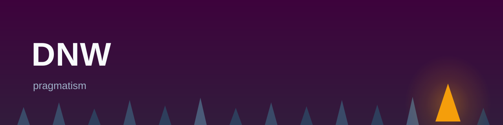

## Who I am

My name is Daniel and I'm a self-taught programmer. Starting at the age of 9, my interests in computers became deeply embedded in my brain, and I later recognized it as an essential source of passion in life. I followed my own path and continue to be a life-long leaner. I'm rewarded by helping others and producing quality code I am proud of.

I write my own prose with intention and won't paste slop at you.

Philosophies that resonate with me:

- Quality over speed.
- A deep topic is simple to communicate for someone with a complete understanding.
- Choose the right tool for the job, not the job for the tool.
- Care about what you do, both the craft and the work.
- See the forest from the trees: why are you doing what you are doing? 

# Work projects

Many of the projected I've worked on have been closed source/proprietary but in the last few years several of them have been open source.

- [The Graph's Indexer Agent](github.com/graphprotocol/indexer)
- [Casper Node](github.com/casper-network/casper-node)

# Meaningful/Interesting Research Projects I've worked on

Not intended as an exhaustive list, but here are some projects that I think are worth mentioning. Many of my projects here are research or educational drives and thus represent a multitude of snapshots into my thinking at different times in my development.

### AI era

#### - [balloons](https://github.com/dwerner/balloons)

Psychosis-phase (I can build *anything* now!) building my own agent when the biggest issue with claude was it's ink rendering. Evolved from a TUI into a websocket-based service with a react frontend. Backend is async python + rust + lmdb. I used this agent in earnest for real work for a few months. (*Opencode since lured me away, and Oh-My-Pi is where I settled after that. For now.*)

Primarily, this was built to investigate session context-management. The origin of the desire: while using claude in those first few months I found I was hitting the 100K token slump and asking for a summary of the recent decisions and context. I would just ask it to create a markdown file, many others have since done that.

This harness was an exploration of prompt and context management ideas and prototypes, including condensing an existing session, adding plugins, browser orchestration, lots of other stuff. 
#### - [rmpl](https://github.com/dwerner/rmpl)

Alternative timeline rust build tool. Idea is a monorepo where all dependencies live, rather than supporting crates at all.
#### - [erigon-dumper](https://github.com/dwerner/erigon-dumper)

Implementing a rust-based huffman-coding dumper for erigon's segment files. Was looking to learn how to push an agent to implement tough algos, with highly mixed results.
#### - Typed Arrow, [Struct-like views](https://github.com/tonbo-io/typed-arrow/pull/12)

### Pre-AI

## - [sg-engine](https://github.com/dwerner/sg-engine)
## - [Nanactyl](https://github.com/dwerner/nanactyl) 

Both of these projects are an evolution of a research game engine concept that I had been working on with since beginning with rust (2015-2016).